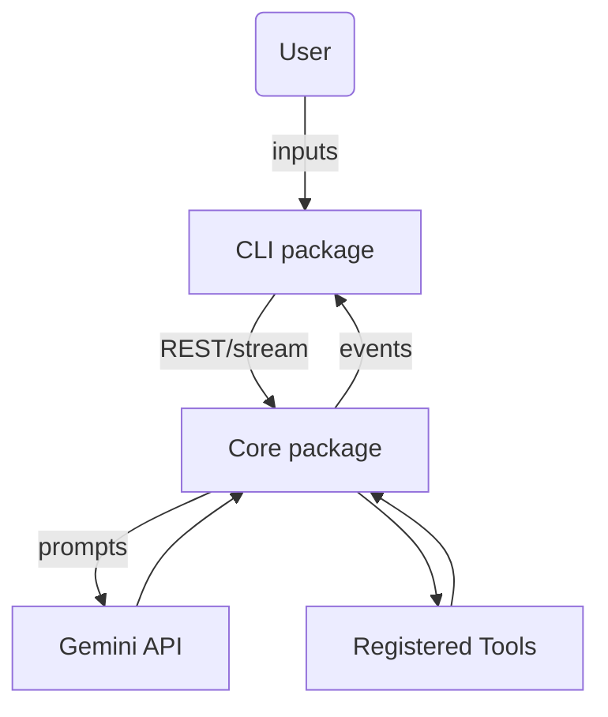
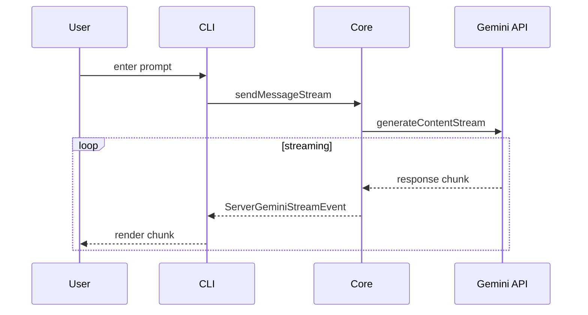
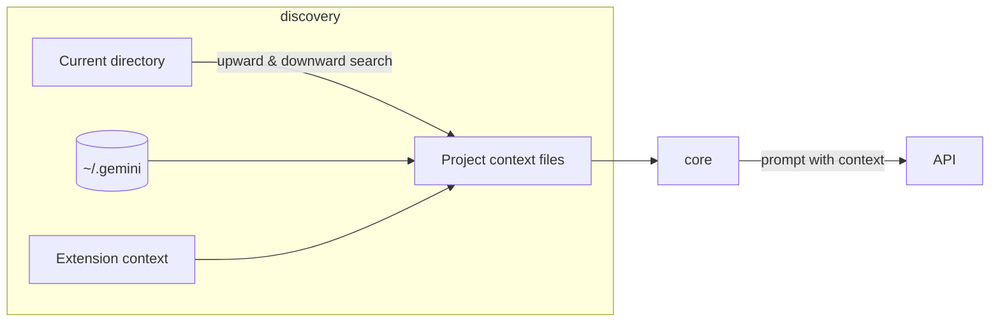

# Core Interactions

This document summarizes how key subsystems within Gemini CLI work together. It focuses on the streaming workflow, conversation management, and context loading mechanisms.

## Overview

The project is split into two primary packages:

- **CLI (`packages/cli`):** Terminal UI written with [Ink](https://github.com/vadimdemedes/ink). It handles user input, displays streaming responses and manages local session state.
- **Core (`packages/core`):** Backend service invoked by the CLI. It constructs prompts, communicates with the Gemini API and orchestrates tool execution.

Additional tools and services are implemented under `packages/core/src/tools` and integrated via the core package.

### High‑level component relationships

- The CLI sends the user's request to the Core using the local `GeminiClient`.
- The Core relays the request to the Gemini API via the `GeminiChat` class.
- The Core can invoke tools (filesystem, shell, etc.) when requested by the model.
- Streaming and other events flow back to the CLI for rendering.

## Streaming pipeline

1. **CLI interaction:** `useGeminiStream` (in `packages/cli/src/ui/hooks`) initiates a call to `geminiClient.sendMessageStream`.
2. **Turn processing:** The core creates a `Turn` object which manages a generator of `ServerGeminiStreamEvent` events. These include content chunks, tool call requests, confirmation prompts and errors.
3. **Gemini API calls:** `GeminiChat.sendMessageStream` forwards the accumulated history plus the new user message to the Gemini API using `generateContentStream` from `@google/genai`.
4. **Event emission:** As the API yields chunks, `Turn.run` interprets them and yields standardized stream events. Tool calls are queued in `pendingToolCalls` until executed.
5. **CLI updates:** `useGeminiStream` consumes the stream, updating UI state through React contexts (`StreamingContext`, `SessionContext`). Tool requests trigger confirmation dialogs and eventual execution via `useReactToolScheduler`.

## Conversation history and compression

- `GeminiChat` stores alternating `user` and `model` turns.
- When history approaches model token limits, the core compresses it and emits a `ChatCompressed` event. The CLI displays a notice so the user knows future prompts will use the condensed context.
- Conversation checkpoints (see `docs/checkpointing.md`) save both history and project state before executing write‑capable tools.

## Context discovery

Context files (`GEMINI.md`) are discovered by `memoryDiscovery.ts` under `packages/core/src/utils`:

1. The service searches upward toward the project root and downward into subdirectories.
2. Global files under `~/.gemini/` are always loaded if present.
3. Imported snippets inside GEMINI.md files are processed through the memory import processor, allowing modular context.

The assembled context forms part of the prompt sent for every turn, ensuring the model has access to relevant project instructions.

## Interaction summary

- **User input** is captured by the CLI and processed for slash or `@` commands.
- **Streaming events** from the Gemini API are normalized by the core and delivered to the CLI to update the terminal in real time.
- **Conversation state** is maintained within the core and periodically compressed to stay within token limits.
- **Context files** are auto‑loaded and included in prompts so the model can reason about the project.

These subsystems work together to provide a responsive and context‑aware workflow for developers using Gemini CLI.
