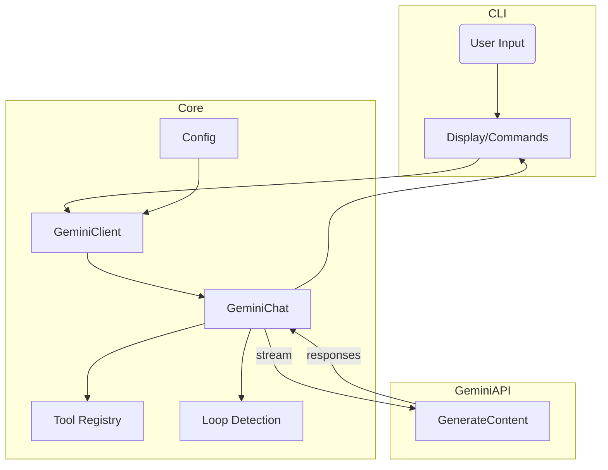
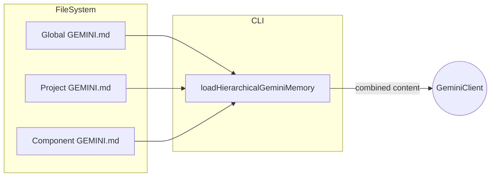
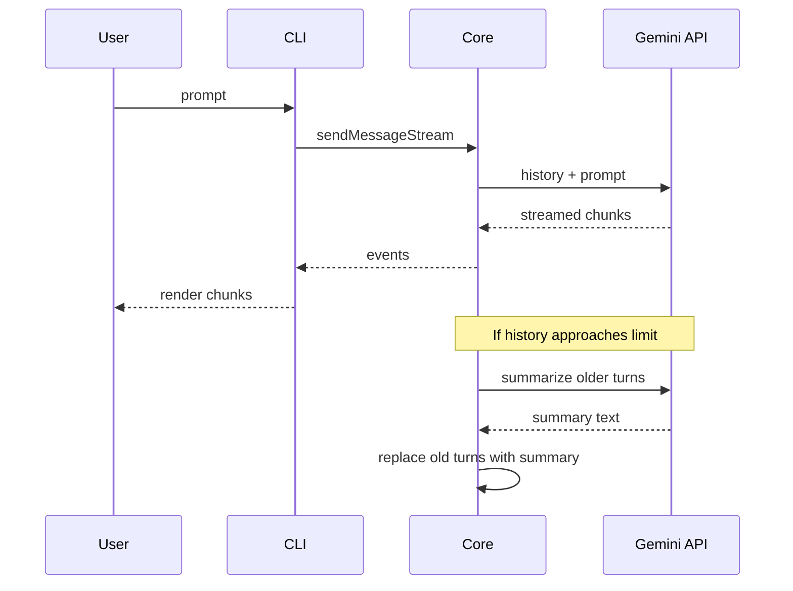
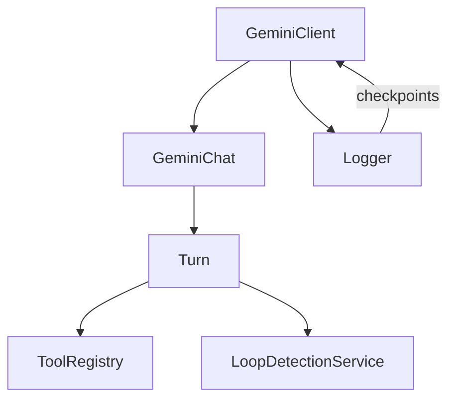

# Core Interactions

This document provides a detailed overview of how the major subsystems of the Gemini CLI work together. The focus is on **streaming**, **context management**, and **conversation state** within the core and CLI packages.

## Overview

At a high level, user input flows from the CLI to the core package, which constructs prompts, manages conversation history, and interfaces with the Gemini API. Responses (including streamed events) are then relayed back to the CLI.

* `GeminiClient` orchestrates the conversation lifecycle. It sets up an initial chat session (`GeminiChat`) with environment context and tool declarations.
* `GeminiChat` handles sending messages, either in a single response (`sendMessage`) or as a stream (`sendMessageStream`).
* Streaming responses consist of a sequence of events representing text, function/tool calls, or special markers. The CLI consumes these events to update the terminal UI.
* `LoopDetectionService` monitors streamed events for repeated content or repeated tool calls.
* The `ToolRegistry` manages available tools and is consulted whenever the model requests a tool execution.

## Context Loading

Context is assembled from multiple `GEMINI.md` files. The CLI configuration resolves and concatenates these files through the *memory discovery service* when the session starts or when `/memory refresh` is issued.

The combined memory is sent to the core which prepends it to prompts. The Memory Tool (`save_memory`) can append facts to the user's global `GEMINI.md` file. The `memport` feature allows `GEMINI.md` files to include other markdown files using `@file.md` syntax.

## Conversation History and Compression

`GeminiChat` stores the alternating user/model messages for the session. To avoid exceeding model token limits, `GeminiClient` can compress older history using a summarization step.

Compression preserves recent turns while summarizing earlier ones. The summary and remaining history become the context for subsequent prompts.

## Streaming Flow Details

When the CLI sends a message via `sendMessageStream`:

1. The core forwards history and the new user message to the Gemini API using `generateContentStream`.
2. Each streamed response chunk is inspected. Text is yielded as a `Content` event, and any function calls are yielded as `ToolCallRequest` events.
3. The CLI displays the text incrementally. If a tool call is requested, the CLI confirms execution, then uses the tool registry to run the tool. Tool results are sent back into the conversation so the model can continue.
4. The Loop Detection service checks for repeated sentences or identical consecutive tool calls. If detected, a `LoopDetected` event is emitted and the stream stops.
5. After streaming completes, `GeminiChat` appends the user input and resulting model output to the history.

## Relationships of Core Components

* **Turn**: encapsulates a single request/response cycle, emitting events for each streamed chunk and handling tool calls.
* **Logger**: persists chat history checkpoints and session logs.
* **GeminiClient**: high-level orchestration—initializes chats, manages compression, and exposes `sendMessageStream` to the CLI.

## Summary

The Gemini CLI's core interacts with the Gemini API through streaming calls, keeping conversation history and contextual memory synchronized. Streaming events allow the UI to display text as it arrives and to intercept tool calls. Hierarchical context loading from `GEMINI.md` files ensures the model always has relevant instructions. Conversation compression and loop detection maintain session health during long interactions.
