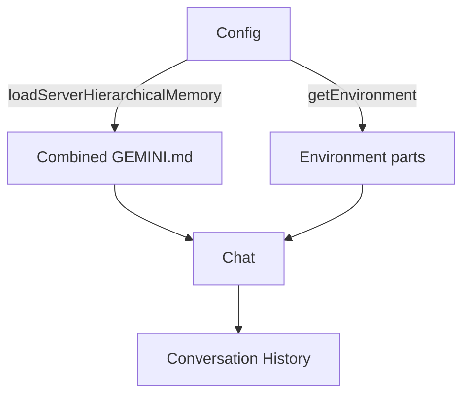
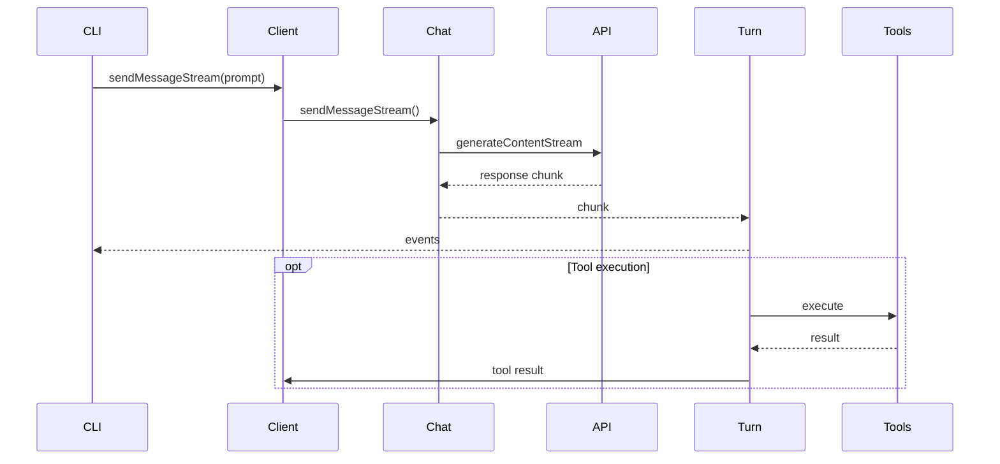

# Core Interactions Overview

This document describes how the main subsystems of the Gemini CLI interact. It focuses on three areas:

- **Streaming** of model responses and tool events
- **Context** accumulation from `GEMINI.md` files and environment data
- **Conversation** management via `GeminiChat` and `GeminiClient`

## High-Level Connectivity

```mermaid
flowchart TD
  UI[CLI (useGeminiStream)] -->|send prompts| Client[GeminiClient]
  Client -->|startChat()| Chat[GeminiChat]
  Chat -->|sendMessageStream| Generator[ContentGenerator]
  Generator --> GeminiAPI[Google Gemini API]
  GeminiAPI -->|streamed chunks| Chat
  Chat --> Turn[Turn]
  Turn -->|events| UI
  Turn -->|tool requests| ToolRegistry
  ToolRegistry --> Tools[Local/MCP Tools]
  Tools --> Turn
```

The CLI uses `useGeminiStream` to communicate with `GeminiClient`. The client creates a `GeminiChat` session and streams responses through a `ContentGenerator`. Chunks from the Gemini API are turned into events by `Turn` which are consumed by the CLI. Tool requests and their results pass through the `ToolRegistry`.

## Context Accumulation

`Config.refreshMemory` loads context from hierarchical `GEMINI.md` files using `loadServerHierarchicalMemory`. This collects content from global, project, and extension locations and concatenates it for use as a system prompt.



The `GeminiClient` builds initial environment parts (current directory, date, OS, folder structure) and attaches the combined memory to the system instruction when starting a chat.

## Conversation and Streaming

`GeminiClient.sendMessageStream` orchestrates message streaming. It creates a `Turn` and yields `ServerGeminiStreamEvent` objects until completion.



Within `GeminiChat.sendMessageStream`, the code constructs the request from current history, calls `generateContentStream`, retries on transient errors, and processes each chunk:

```ts
await this.sendPromise;
const userContent = createUserContent(params.message);
const requestContents = this.getHistory(true).concat(userContent);
this._logApiRequest(requestContents, this.config.getModel(), prompt_id);
...
const streamResponse = await retryWithBackoff(apiCall, {...});
...
const result = this.processStreamResponse(
  streamResponse,
  userContent,
  startTime,
  prompt_id,
);
```
【F:packages/core/src/core/geminiChat.ts†L382-L441】

`processStreamResponse` collects valid chunks, logs the final usage data, and updates the history:

```ts
for await (const chunk of streamResponse) {
  if (isValidResponse(chunk)) {
    chunks.push(chunk);
    const content = chunk.candidates?.[0]?.content;
    if (content !== undefined) {
      if (this.isThoughtContent(content)) {
        yield chunk;
        continue;
      }
      outputContent.push(content);
    }
  }
  yield chunk;
}
...
await this._logApiResponse(
  durationMs,
  prompt_id,
  this.getFinalUsageMetadata(chunks),
  fullText,
);
this.recordHistory(inputContent, outputContent);
```
【F:packages/core/src/core/geminiChat.ts†L512-L561】

The `Turn` class converts these chunks into higher-level events such as content, tool calls, or errors:

```ts
const responseStream = await this.chat.sendMessageStream({...}, this.prompt_id);
for await (const resp of responseStream) {
  if (signal?.aborted) {
    yield { type: GeminiEventType.UserCancelled };
    return;
  }
  this.debugResponses.push(resp);
  const thoughtPart = resp.candidates?.[0]?.content?.parts?.[0];
  if (thoughtPart?.thought) {
    ...
    yield { type: GeminiEventType.Thought, value: thought };
    continue;
  }
  const text = getResponseText(resp);
  if (text) {
    yield { type: GeminiEventType.Content, value: text };
  }
  const functionCalls = resp.functionCalls ?? [];
  for (const fnCall of functionCalls) {
    const event = this.handlePendingFunctionCall(fnCall);
    if (event) {
      yield event;
    }
  }
}
```
【F:packages/core/src/core/turn.ts†L167-L224】

## Loading Memory

`loadServerHierarchicalMemory` assembles all `GEMINI.md` files found in the user, project, and extension directories, producing a single block of instructions:

```ts
export async function loadServerHierarchicalMemory(
  currentWorkingDirectory: string,
  debugMode: boolean,
  fileService: FileDiscoveryService,
  extensionContextFilePaths: string[] = [],
): Promise<{ memoryContent: string; fileCount: number }> {
  const userHomePath = homedir();
  const filePaths = await getGeminiMdFilePathsInternal(
    currentWorkingDirectory,
    userHomePath,
    debugMode,
    fileService,
    extensionContextFilePaths,
  );
  const contentsWithPaths = await readGeminiMdFiles(filePaths, debugMode);
  const combinedInstructions = concatenateInstructions(
    contentsWithPaths,
    currentWorkingDirectory,
  );
  return { memoryContent: combinedInstructions, fileCount: filePaths.length };
}
```
【F:packages/core/src/utils/memoryDiscovery.ts†L250-L313】

These instructions are incorporated when `GeminiClient` calls `startChat`, forming the initial history and system prompts:

```ts
const envParts = await this.getEnvironment();
const toolDeclarations = toolRegistry.getFunctionDeclarations();
const tools: Tool[] = [{ functionDeclarations: toolDeclarations }];
const history: Content[] = [
  { role: 'user', parts: envParts },
  { role: 'model', parts: [{ text: 'Got it. Thanks for the context!' }] },
  ...(extraHistory ?? []),
];
const userMemory = this.config.getUserMemory();
const systemInstruction = getCoreSystemPrompt(this.config, userMemory);
return new GeminiChat(
  this.config,
  this.getContentGenerator(),
  {
    systemInstruction,
    ...generateContentConfigWithThinking,
    tools,
  },
  history,
);
```
【F:packages/core/src/core/client.ts†L223-L261】

## Summary

- The **Context subsystem** gathers environment details and combined `GEMINI.md` memory via `loadServerHierarchicalMemory`, injecting them into the `GeminiChat` system instruction.
- The **Conversation subsystem** maintains history and compresses it when needed. `GeminiChat` handles message sending and history updates.
- The **Streaming subsystem** uses `GeminiClient.sendMessageStream` and `Turn.run` to transform API chunks into events consumed by the CLI, including tool requests and execution results.

Together these subsystems enable interactive sessions where the user can converse with Gemini, receive streaming responses, and incorporate long-term memory and tools.
