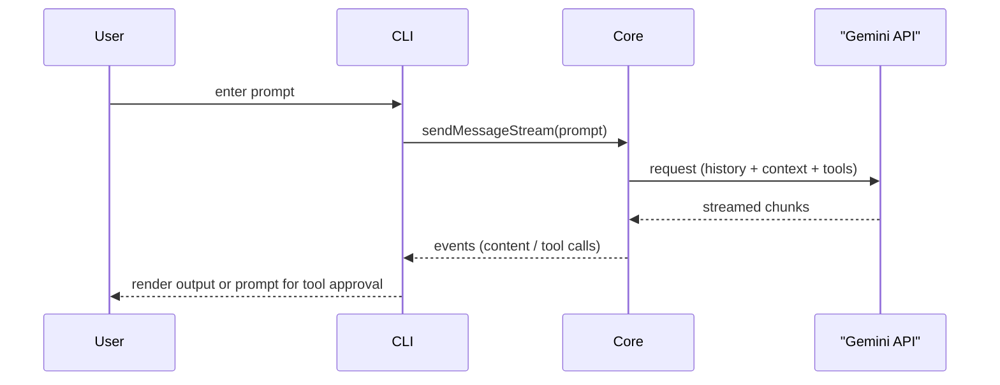
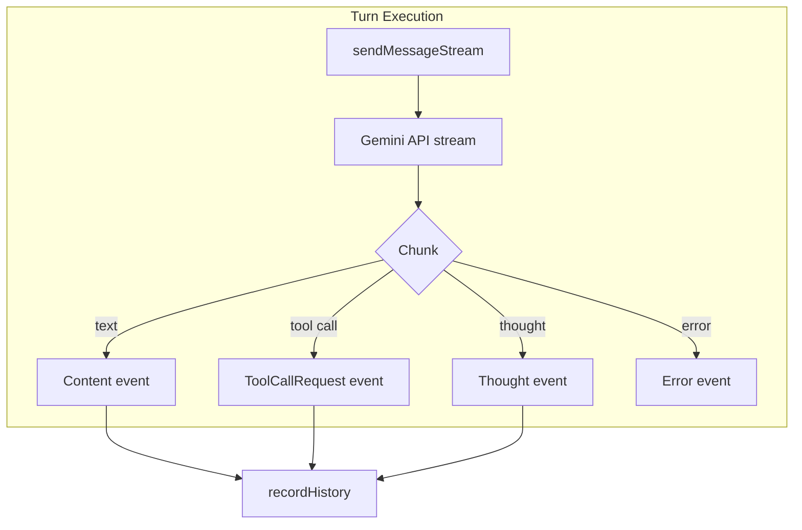

# Core Interactions

This document describes how the core package orchestrates conversation, context management, and streaming communication with the Gemini API. It summarizes the data flow between the CLI, the core services and the model, and highlights key interaction points.

## Overview

The Gemini CLI is split into two main packages: the user facing CLI (`packages/cli`) and the backend core (`packages/core`). The core handles prompt construction, tool execution and communication with the Gemini API while maintaining conversation state. The following diagram illustrates the overall flow:



`packages/core` tracks the conversation through a `GeminiChat` instance and exposes methods such as `sendMessageStream()` for streaming responses. Tool invocation, context discovery and memory management are also handled inside the core.

## Context Handling

### Memory discovery service

The memory discovery service searches for `GEMINI.md` files in a hierarchy from the current working directory up to the project root and the user's home directory. The contents of all discovered files are concatenated and made available as user memory. This behaviour is implemented in `memoryDiscovery.ts`:

```ts
// loading files in hierarchy
const filePaths = await getGeminiMdFilePathsInternal(
  currentWorkingDirectory,
  userHomePath,
  debugMode,
  fileService,
  extensionContextFilePaths,
);
...
const contentsWithPaths = await readGeminiMdFiles(filePaths, debugMode);
const combinedInstructions = concatenateInstructions(
  contentsWithPaths,
  currentWorkingDirectory,
);
```

The discovery logic supports both upward and downward scanning and includes extension-provided context files. Lines showing this process can be found in `memoryDiscovery.ts` around `getGeminiMdFilePathsInternal` and `loadServerHierarchicalMemory`【F:packages/core/src/utils/memoryDiscovery.ts†L82-L218】【F:packages/core/src/utils/memoryDiscovery.ts†L220-L319】.

### Environment context

When a chat starts, environment information is collected to set up the initial conversation. The method `getEnvironment()` constructs a text block describing the current directory, date and detected files. If the `fullContext` flag is enabled, all project files are read and included. This is used as the first user message:

```ts
const cwd = this.config.getWorkingDir();
const today = new Date().toLocaleDateString(...);
const folderStructure = await getFolderStructure(cwd, { fileService: this.config.getFileService() });
const context = `
  This is the Gemini CLI. We are setting up the context for our chat.
  Today's date is ${today}.
  My operating system is: ${platform}
  I'm currently working in the directory: ${cwd}
  ${folderStructure}
`.trim();
```

This snippet is from `client.ts`【F:packages/core/src/core/client.ts†L160-L177】. If full file context is requested, the `read_many_files` tool is used to inject all project content into this first message【F:packages/core/src/core/client.ts†L182-L205】.

### Combining memory and tools

After collecting environment context and loading memory, `startChat()` composes the system instruction and attaches tool declarations before creating the `GeminiChat` instance:

```ts
const userMemory = this.config.getUserMemory();
const systemInstruction = getCoreSystemPrompt(this.config, userMemory);
const toolDeclarations = toolRegistry.getFunctionDeclarations();
const tools: Tool[] = [{ functionDeclarations: toolDeclarations }];
const history: Content[] = [
  { role: 'user', parts: envParts },
  { role: 'model', parts: [{ text: 'Got it. Thanks for the context!' }] },
  ...(extraHistory ?? []),
];
return new GeminiChat(this.config, this.getContentGenerator(), { systemInstruction, ...generateContentConfigWithThinking, tools }, history);
```

These lines are found in `startChat()`【F:packages/core/src/core/client.ts†L236-L261】.

## Conversation Flow

`GeminiChat` keeps a comprehensive history of all turns between user and model. Two variants of the history are maintained:

- **Curated history** – valid turns suitable for sending back to the model.
- **Comprehensive history** – a full record including invalid or empty outputs.

The getter `getHistory()` returns either version as needed【F:packages/core/src/core/geminiChat.ts†L451-L479】.

To prevent exceeding model token limits, `GeminiClient.tryCompressChat()` can summarize older turns and restart the conversation with that summary preserved. The core decides when to trigger compression based on token counts and a configurable threshold:

```ts
const { totalTokens: originalTokenCount } = await this.getContentGenerator().countTokens({ model, contents: curatedHistory });
if (!force && originalTokenCount < this.COMPRESSION_TOKEN_THRESHOLD * tokenLimit(model)) {
  return null;
}
// summarize early history and restart chat with a state snapshot
const { text: summary } = await this.getChat().sendMessage({ message: { text: 'First, reason in your scratchpad. Then, generate the <state_snapshot>.' }, config: { systemInstruction: { text: getCompressionPrompt() } } }, prompt_id);
this.chat = await this.startChat([
  { role: 'user', parts: [{ text: summary }] },
  { role: 'model', parts: [{ text: 'Got it. Thanks for the additional context!' }] },
  ...historyToKeep,
]);
```

Relevant code resides around `tryCompressChat()`【F:packages/core/src/core/client.ts†L526-L612】.

## Streaming Interaction

Messages are usually sent via `sendMessageStream()`, which forwards the request to the Gemini API and yields each chunk of the streamed response. Retry logic handles transient errors and model fallback. Chunks are also accumulated so that the final text can be logged and appended to history:

```ts
async sendMessageStream(params: SendMessageParameters, prompt_id: string): Promise<AsyncGenerator<GenerateContentResponse>> {
  await this.sendPromise;
  const userContent = createUserContent(params.message);
  const requestContents = this.getHistory(true).concat(userContent);
  const streamResponse = await retryWithBackoff(apiCall, { ... });
  const result = this.processStreamResponse(streamResponse, userContent, startTime, prompt_id);
  return result;
}
```

During `processStreamResponse`, each chunk is emitted back to the caller while valid content is accumulated. After the stream finishes, history is updated and telemetry is recorded【F:packages/core/src/core/geminiChat.ts†L378-L441】【F:packages/core/src/core/geminiChat.ts†L520-L560】.

A conversation turn is managed by `Turn`, which converts streaming results into structured events such as content tokens, tool call requests and errors. These events are propagated back to the CLI for user interaction or display【F:packages/core/src/core/turn.ts†L70-L113】【F:packages/core/src/core/turn.ts†L217-L232】.

The high-level streaming behaviour is summarized below:



## Conclusion

Through the combination of memory discovery, environment setup, history management and streaming communication, the core package coordinates all interactions between the CLI user and the Gemini API. It maintains a robust conversation state, ensures relevant context is delivered with each request, and exposes structured events so that the CLI can provide a responsive and interactive user experience.

